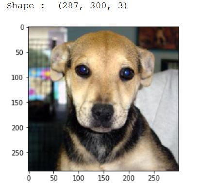

# Image Classifier
Classify Images of Cats and Dogs

The project is based on **Convolutional Neural Networks (CNN)**. It classifies
the images of Cats and Dogs.

1. 'predictions.py' is a python file that uses saved model to predict the image
2. 'myCNN.model' is a model file that contains the trained model
3.  Model file is developed by training Convolutional Neural Networks on cats and dog images
4.  Model optimization is done using **Tensorboard**
5.  **Keras** is the Library used for Deep Learning here
6.  The test Accuracy of model is **80 percent.**

## Dataset
Dataset consists of two sets. Training set contains **8000** images each for cats and dogs, whereas test set contains **1500** images each for dogs and cats. So total of **16000** images for training model and **3000** images for testing the model. 

## Data Preprocessing
Preprocessing is done as not all the images are of same shape and size. This is done using Python's **OpenCV** Library. 

### 1. Load Original Image 

Cat                                            |  Dog
:---------------------------------------------:|:-------------------------:
  |  
   
### 2. Convert images into gray scale. 
This is because we are only concerned with patterns in images and not the color. This is also a memory efficient step as colored images occupy more space than Grey scale images

Cat (Gray Scale)                               |  Dog (Gray Scale)
:---------------------------------------------:|:-------------------------:
   |  

### 3. Resize images 
This is done so that all images are of same size and can be operated on smoothly

Cat (Resized)                                  |  Dog (Resized)
:---------------------------------------------:|:-------------------------:
   |  

### 4. Convert the image data into a numpy array to feed it to the model
Machine Learning and Deep Learning models or machines only take numeric data as input so the image data is converted to **numpy array**. Now this numpy arrary contains the numbers between **0 - 255 (Gray Scale imges)** where 0 is the most black part and 255 being the most white part in image. 
Each image is converted into separate numpy arrays and then combined to one list.

## Model Training and Performance
Model is trained on the data prepared using Convolutional Neural Networks (CNNs) technique. Keras library is used for training purpose and model is optimized with the help of Tensorboard. 

The best performing model with ***test accuracy 80.1%*** has combination of -  
**Dense Layers = 0** 
**Layer Size = 64** 
**Conv Layers = 3** 

